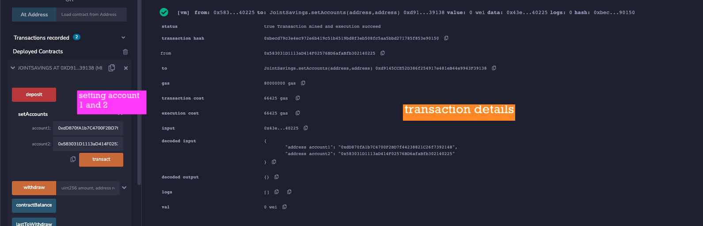
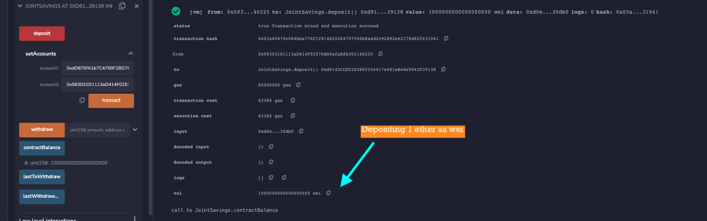
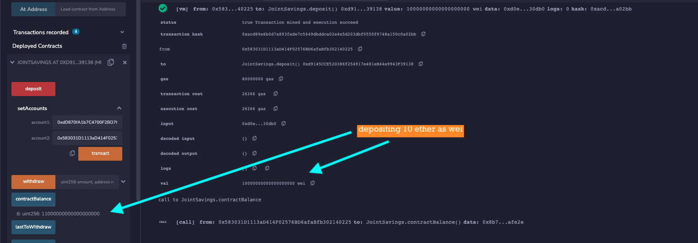
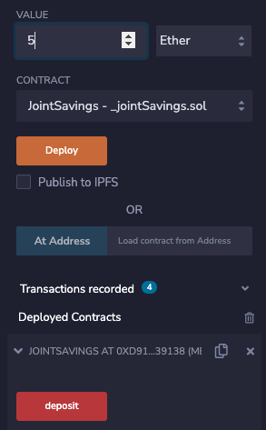
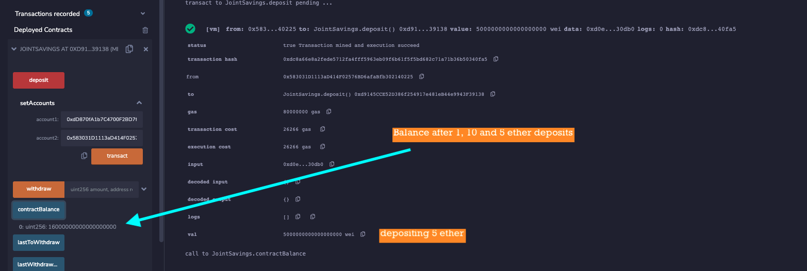
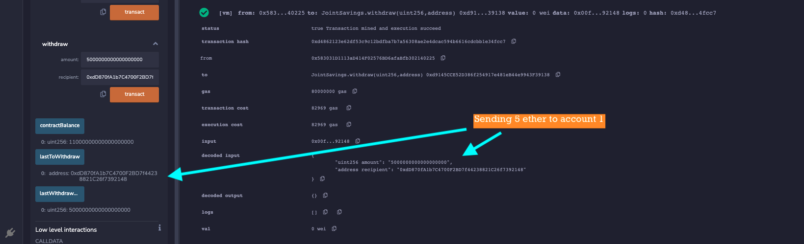
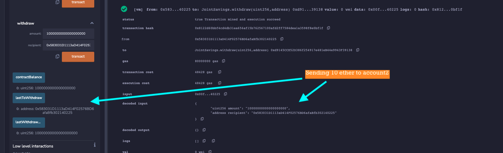

# Joint Savings Account

A fintech startup company has recently hired me. This company is disrupting the finance industry with its own cross-border, Ethereum-compatible blockchain that connects financial institutions. Currently, the team is building smart contracts to automate many of the institutions’ financial processes and features, such as hosting joint savings accounts.
To automate the creation of joint savings accounts, I created a Solidity smart contract that accepts two user addresses. These addresses are be able to control a joint savings account. My smart contract uses ether management functions to implement a financial institution’s requirements for providing the features of the joint savings account. These features consist of the ability to deposit and withdraw funds from the account.

## Interacting with My Deployed Smart Contract

### Setting authorized accounts

I use **setAccounts** function to whitelist two ethereum accounts. They are called account 1 and account 2. 

account 1 address: 0xdD870fA1b7C4700F2BD7f44238821C26f7392148

account 2 address: 0x583031D1113aD414F02576BD6afaBfb302140225

### Deposits
I am going to have three deposits to my contract. First, 1 ether as wei, then 10 ether as wei, and the last transaction is going to be 5 ether.

First, I deposit ether to my smart contract. My first deposit is 1 ether as wei.

Then I do my second deposit. The second deposit is 10 ether as wei.

My last deposit is 5 ether.

After my three deposit, I call **contract balance** to check total balance.

### Transacting with accounts

I am sending 5 ether to  account 1. Transaction is succesful and below you can see the details including transaction amount, address and contract balance. I also call **lastWithdrawTo** and **lastWithdrawalAmount** functions.

Then I send 10 ether to account 2.

**lastWithdrawTo** and **lastWithdrawalAmount** functions are called after sending 10 ether to account 2.